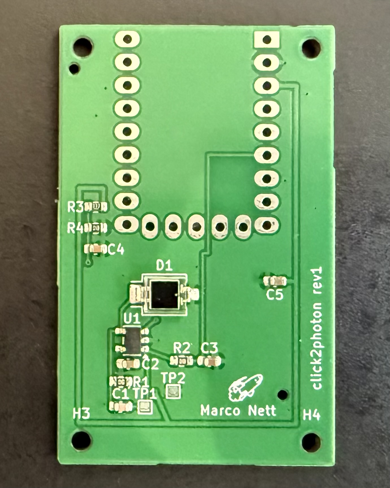
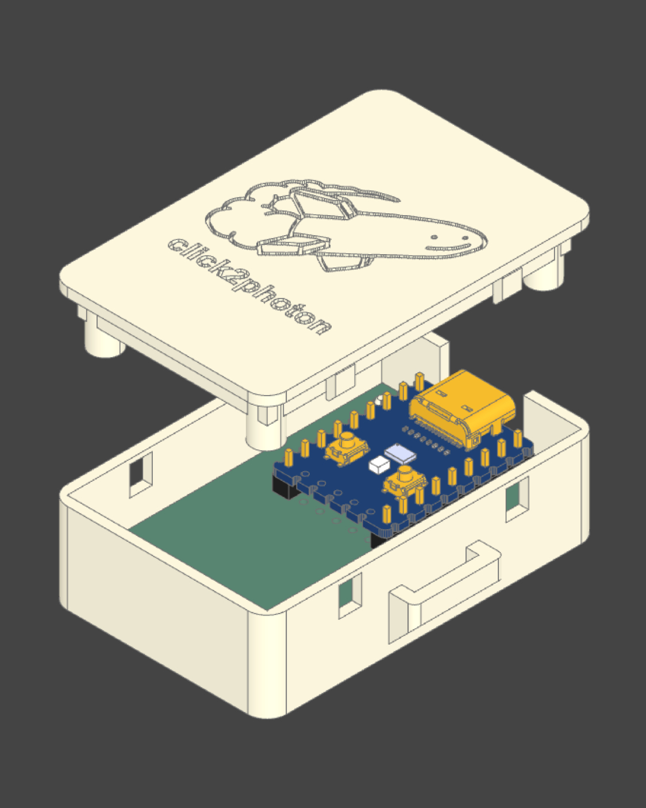
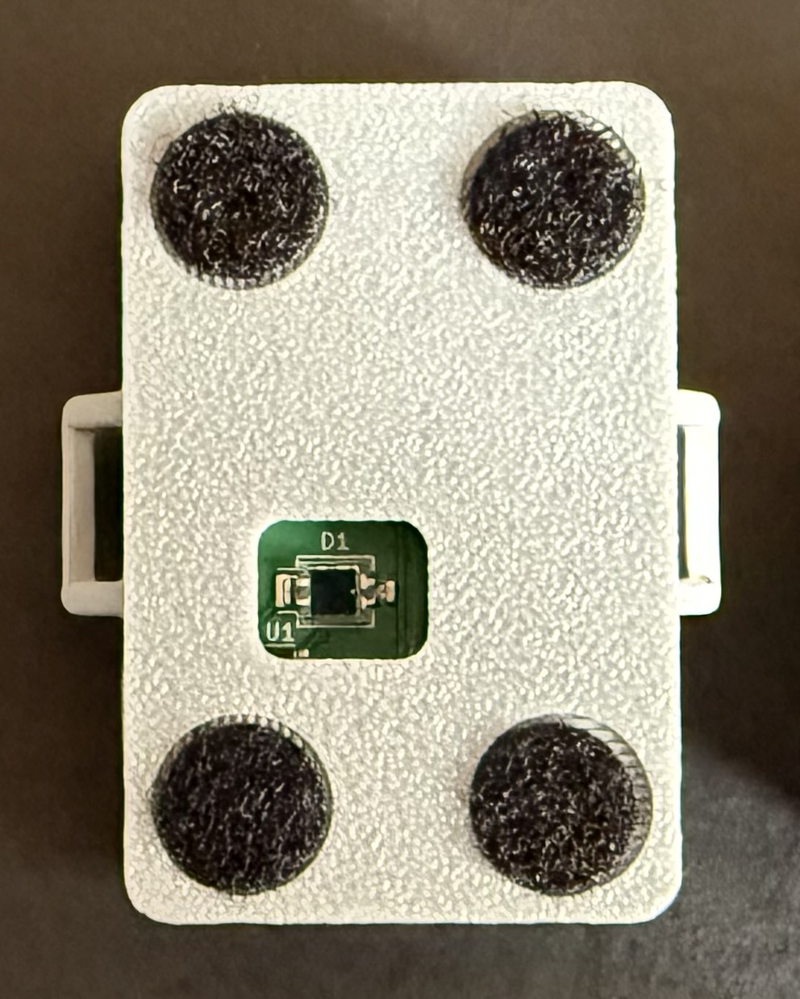

# frameprobe

End-to-end display latency measurement: the time from a mouse click to a visible
change on screen, measured with a photodiode strapped to the monitor.

**How it works:**

- An RP2040 sends a USB HID mouse click
- The color switcher app toggles the screen black/white
- The photodiode picks up the change
- The RP2040 streams ADC samples over serial
- The host logs them to CSV
- `analyze.py` computes the latency

## Components

| Component | Path | Description |
|---|---|---|
| Hardware | `hardware/` | KiCad 10 PCB source (`hardware/pcb/`) and 3D-printable enclosure for the sensor (VBPW34S photodiode + TLV9061 transimpedance amplifier). |
| Firmware | `arduino/` | Runs on any RP2040 board. Fires the mouse click, samples the photodiode on A1 (14-bit ADC, 12,000 samples per run), sends results as CSV lines over serial. |
| Host software | `main.py` | Interactive serial terminal. Starts/stops test runs, configures click count and interval, logs device data to `output/*.csv`. |
| Analyzer | `analyze.py` | Computes latency from session CSVs or whole folders. Reports signal/noise separation, mean ± 95% CI, sd, median, p5, p95, spread, min, max and an ASCII histogram. Every field is explained in [analyze.md](./analyze.md). |
| Chart data | `analyze_all.py` | Pools each direct subfolder of a results folder and prints chart-ready JSON (medians with error bars, plus shared-bin histograms) for comparing test cases. |
| Color switcher | `color-switcher-vulkan/` | C++ Vulkan app that toggles the screen black/white on left click, presenting with `IMMEDIATE` (no vsync) for minimal rendering latency. Build with `./build_vulkan.sh`, run with `./run_vulkan.sh`, quit with Esc. |
| Reference data | `test_run1/` | Captures and notes from an X11-vs-Wayland test matrix on a 500 Hz QD-OLED (`test_setup.md`, `test_matrix.md`). Done with Perfboard-era sensor, use `-t 100` to reproduce the published numbers. |

## Images

  

## Host software CLI (`main.py`)

Auto-detects the device by USB VID/PID and provides an interactive prompt. Pass a port
as the first argument to override the search (`uv run main.py /dev/ttyACM1`).

| Command | Description |
|---|---|
| `start` | Start a test session (3s countdown). Logs to `output/<timestamp>_session.csv`. |
| `stop` | Stop the test and close the session CSV. |
| `debug`, `d` | Enable debug mode — device streams raw ADC readings and voltage. |
| `interval <float>`, `i <float>` | Set the time between clicks in seconds (default 0.5). |
| `clicks <int>`, `c <int>` | Set the number of clicks per session (default 10). |
| `connect` / `disconnect` | Open / close the serial connection. |
| `help` | Show the command list. |
| `exit`, `quit` | Disconnect and quit. |

## Usage

`main.py` and `analyze.py` run on macOS, Linux and Windows.

```sh
uv sync                     # set up Python environment
./run_vulkan.sh             # start the color switcher on the monitor under test
uv run main.py              # connect to the device, then type: start
uv run main.py COM5         # might be needed in Windows if COM port auto-detect fails
uv run analyze.py output/<session>.csv
uv run analyze.py output/   # or pool a whole folder of sessions
```

By default, `analyze.py` automatically calibrates based on the given input files.

## Test run

`test_run1/` contains methodology and results of the testing I did for a blog post: [Measuring input latency on Linux: X11 vs Wayland, VRR, and DXVK](https://marco-nett.de/blog/measuring-input-latency-on-linux-x11-vs-wayland-vrr-dxvk/).

This test run was done with a proof-of-concept design of the PCB with less sensitivity. To replicate the results from the blog post exactly, use the analyzer with its historical threshold of 100, for example: `uv run analyze.py test_run1/output/1_x11_ll-ON_vrr-ON -t 100`.